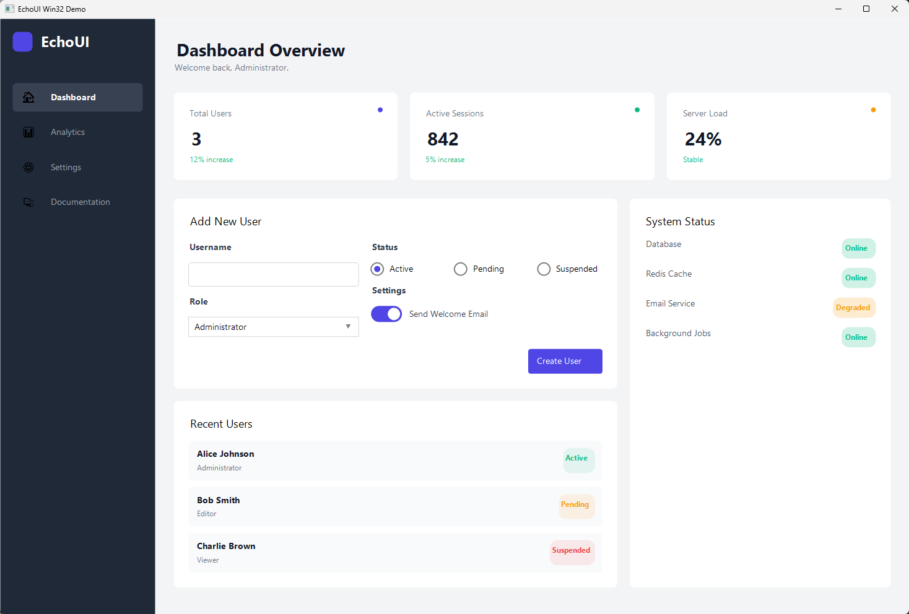
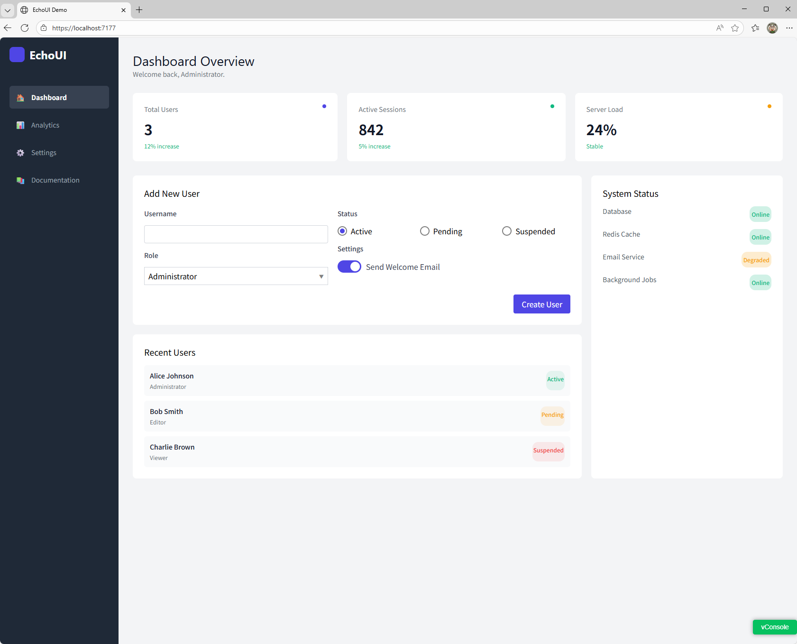

# EchoUI

**[中文](./README.zh-CN.md) | English**

A React-inspired declarative UI framework for .NET 9.0. Virtual DOM reconciler with diffing, hooks system, Roslyn source generator, and multiple rendering backends (Blazor WebAssembly & Win32 GDI+).

## Preview





## Features

- **Declarative Components** — Define UI as pure functions returning element trees, just like React
- **Virtual DOM & Reconciler** — Efficient keyed diffing and batched updates
- **Hooks** — `State`, `Effect`, `Memo`, `Shared` for state management and side effects
- **Source Generator** — `[Element]` attribute auto-generates named-parameter overloads via Roslyn
- **Multi-Backend** — Render to browser DOM (Blazor WASM) or native Win32 windows (GDI+)
- **Built-in Elements** — Button, Input, CheckBox, ComboBox, RadioGroup, Switch, Tabs
- **Flexbox Layout** — Container-based layout with direction, justify, align, gap, flex-grow/shrink

## Quick Start

### Prerequisites

- [.NET 9.0 SDK](https://dotnet.microsoft.com/download/dotnet/9.0)

### Build

```bash
dotnet restore EchoUI.slnx
dotnet build EchoUI.slnx
```

### Run Demos

```bash
# Blazor WebAssembly demo
dotnet run --project EchoUI.Demo.Web/EchoUI.Demo.Web.csproj

# Win32 GDI+ demo (Windows only)
dotnet run --project EchoUI.Demo.Win32/EchoUI.Demo.Win32.csproj
```

## Usage

### Define a Component

```csharp
using static EchoUI.Core.Elements;
using static EchoUI.Core.Hooks;

static Element? Counter(Props props)
{
    var (count, setCount, updateCount) = State(0);

    return Container(new ContainerProps
    {
        Direction = LayoutDirection.Horizontal,
        Gap = 10,
        AlignItems = AlignItems.Center,
        Children =
        [
            Button(new ButtonProps
            {
                Text = "-",
                OnClick = () => updateCount(c => c - 1)
            }),
            Text(new TextProps { Text = $"Count: {count.Value}" }),
            Button(new ButtonProps
            {
                Text = "+",
                OnClick = () => updateCount(c => c + 1)
            }),
        ]
    });
}
```

### Hooks

```csharp
// State — reactive value with setter and updater
var (value, setValue, updateValue) = State(initialValue);

// Effect — side effects with dependency tracking and cleanup
Effect(() =>
{
    Console.WriteLine($"Value changed: {value.Value}");
    return () => { /* cleanup */ };
}, [value.Value]);

// Memo — memoized computation
var expensive = Memo(() => ComputeSomething(value.Value), [value.Value]);

// Shared — cross-component shared state
var shared = Shared<MySharedState>();

// IsInitialRender — check if first render
var isFirst = IsInitialRender();
```

### Source Generator

Mark element factory methods with `[Element]` to auto-generate named-parameter overloads:

```csharp
public static partial class Elements
{
    [Element(DefaultProperty = nameof(ButtonProps.Text))]
    public static Element Button(ButtonProps props) { ... }
}

// Generated overload allows:
Button("Click me", OnClick: () => DoSomething(), BackgroundColor: Color.Blue)
```

The containing class must be `partial`. The generator produces `{Class}.{Method}.ElementOverload.g.cs`.

### Mount & Render

```csharp
// Blazor WebAssembly
var renderer = new WebRenderer("app");
var reconciler = new Reconciler(renderer);
await reconciler.Mount(MyApp);

// Win32 GDI+
var window = new Win32Window(1200, 800, "My App");
var renderer = new Win32Renderer(window);
var reconciler = new Reconciler(renderer);
await reconciler.Mount(MyApp);
window.Run();
```

### Built-in Elements

| Element | Description |
|---|---|
| `Container` | Flexbox layout container with styling, events, transitions |
| `Text` | Text display with font, color, weight |
| `Button` | Interactive button with hover/pressed states |
| `Input` | Text input with two-way binding |
| `CheckBox` | Toggle checkbox with label |
| `ComboBox` | Dropdown select with animated expansion |
| `RadioGroup` | Radio button group (vertical/horizontal) |
| `Switch` | Animated toggle switch |
| `Tabs` | Tabbed content with animated transitions |

### Styling

```csharp
Container(new ContainerProps
{
    Width = Dimension.Pixels(300),
    Height = Dimension.Percent(100),
    Padding = new Spacing(16),
    BackgroundColor = Color.FromHex("#1a1a2e"),
    BorderRadius = 8,
    BorderWidth = 1,
    BorderColor = Color.Gray,
    Transitions = [new Transition(200, Easing.EaseInOut)],
    Overflow = Overflow.Scroll,
    Direction = LayoutDirection.Vertical,
    JustifyContent = JustifyContent.Center,
    AlignItems = AlignItems.Center,
    Gap = 12,
})
```

## Project Structure

```
EchoUI.slnx
├── EchoUI.Core/                  # Core: Element, Props, Hooks, Reconciler, Types
│   └── Elements/                 # Built-in elements (Button, Input, Tabs, etc.)
├── EchoUI.Generator/             # Roslyn incremental source generator
├── EchoUI.Render.Web/            # Blazor WASM renderer
├── EchoUI.Render.Win32/          # Win32 GDI+ renderer
├── EchoUI.Demo/                  # Shared demo components
├── EchoUI.Demo.Web/              # Web demo host
└── EchoUI.Demo.Win32/            # Win32 demo host
```

## Architecture

- **Reconciler** owns the component tree and schedules batched updates via `IUpdateScheduler`
- **HookContext** is `[ThreadStatic]` — hooks are scoped to the current render pass
- **Props diffing** uses reflection; delegate props compared by null-vs-non-null only
- **IRenderer** interface abstracts rendering — implement it to add new backends
- **WebRenderer** bridges to browser DOM via `JSImport`/`JSExport` with `System.Text.Json` source gen
- **Win32Renderer** self-draws with GDI+ and a simplified Flexbox layout engine

## License

See [LICENSE](./LICENSE) for details.
